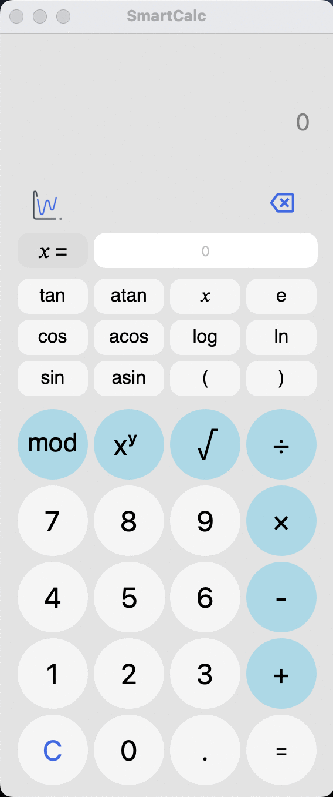
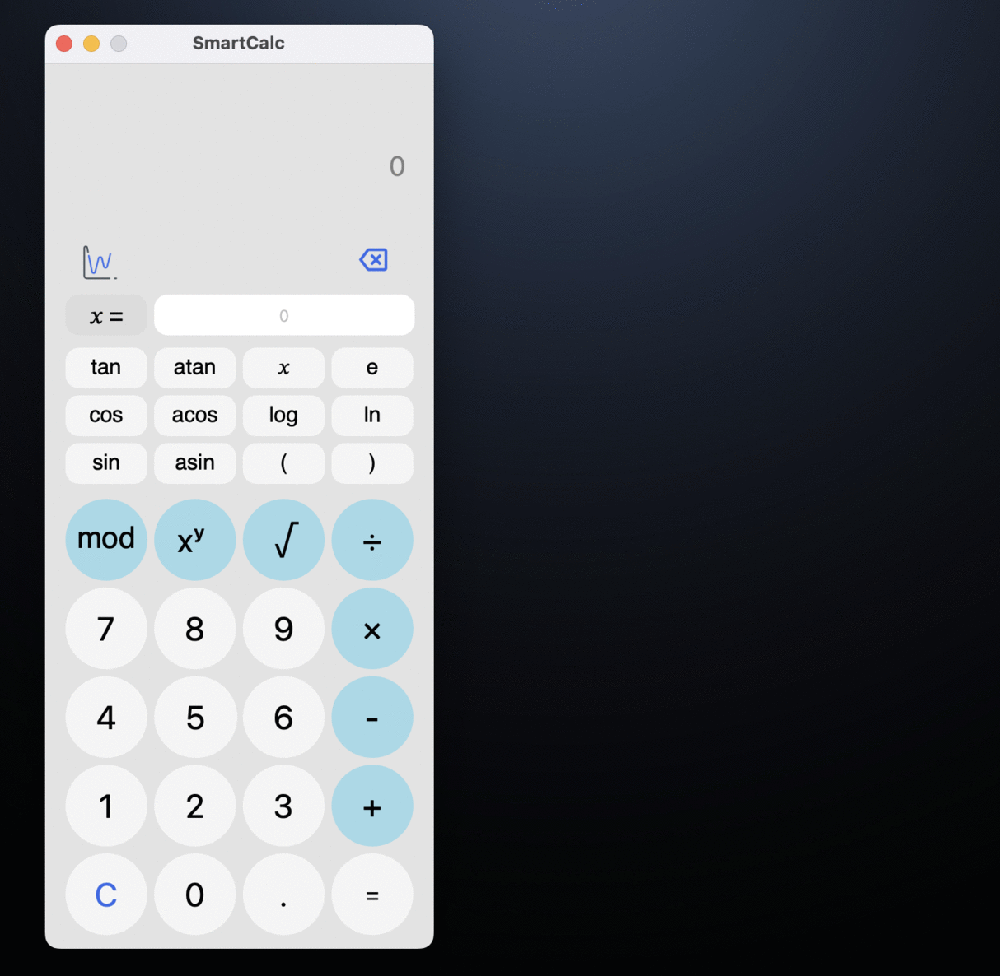

# SmartCalc v2.0

  
  
  

#### 使用 C++17 实现的扩展版传统计算器。

除了加减乘除等基础算术运算外，程序还支持根据运算优先级计算算术表达式，以及使用多种数学函数（如 `sin`、`cos`、对数等）。
同时支持变量 *x*，并可绘制对应函数图像。

  

  

- 程序使用符合 C++17 标准的 C++ 语言开发。
- 程序代码位于 `src` 目录中。
- 程序代码遵循 Google 风格规范。
- 所有类均在 `s21` 命名空间内实现。
- 表达式计算模块使用 GTest 单元测试，并实现了完整覆盖。
- 程序的图形界面基于 Qt 6.7 实现。
- 程序采用 MVC 模式实现。
- 提供包含 `all`、`install`、`uninstall`、`clean`、`check_style`、`dvi`、`dist`、`test`、`gcov_report` 目标的 Makefile。
- 安装目录为 `src/build`。
- `dvi` 目标可生成 Doxygen 风格文档。
- `dist` 目标会生成用于分发的 `.tar` 压缩归档文件。

### 实现说明

#### MVC 模式

MVC（Model-View-Controller，模型-视图-控制器）模式是一种将应用程序划分为三个宏观组件的设计方案：
模型负责业务逻辑，视图负责与程序交互的界面形式，控制器则根据用户操作修改模型。

`view` 包含与程序界面相关的全部代码，而 `model` 负责执行计算。

#### 计算原理

计算功能基于 *Dijkstra 算法*，也就是 *调度场算法（shunting-yard algorithm）*，将表达式转换为 *逆波兰表示法（Reverse Polish Notation）* 后再进行计算。

调度场算法是一种基于栈的算法。表达式转换过程中涉及两个文本变量：输入串和输出串。该过程通过栈保存尚未加入输出串的运算符。程序按顺序读取输入中的每一个记号（token），并根据当前读取到的记号执行相应操作。

#### 算法实现过程

当输入串中仍有未处理记号时，读取下一个记号：

如果该记号是：
- 一个数字 - 将其放入输出队列

- 一个函数或左括号 - 将其压入栈中

- 一个函数参数分隔符（例如逗号）:
    - 将栈中的运算符移动到输出队列，直到栈顶出现左括号。如果栈中没有左括号，则说明表达式有误。

- 一个运算符（O1）:
    - 当栈顶存在另一个运算符 O2，且 O2 的优先级高于 O1，或者二者优先级相同且 O1 为左结合运算符时：
    - 将 O2 从栈中弹出并放入输出队列
    - 将 O1 压入栈中

- 一个右括号:
    - 当栈顶记号不是左括号时，将栈顶运算符弹出并放入输出队列。
    - 弹出左括号并将其丢弃。
    - 如果此时栈顶是函数记号，则将该函数从栈中弹出并放入输出队列。
    - 如果在找到左括号之前栈已为空，则说明表达式有误。

如果输入串中已经没有剩余记号：
- 当栈中仍有运算符时：
    - 如果栈顶是括号，则说明表达式有误。
    - 将该运算符从栈中弹出并放入输出队列。

完毕。

---

 risahamm@student.21-school.ru

simpidbit@gmail.com

